# notes.md

Format wajib per entry — jangan menyimpang dari 4 field ini:

### N-{nomor} | {judul singkat}
Evidence: {EVID-id atau "-" kalau tidak ada}
Type: fact | inference | assumption
Isi: {satu-dua kalimat, faktual untuk fact, jelas ditandai kalau dugaan}

Aturan:
- fact = langsung teramati dari evidence, tidak ada interpretasi
- inference = kesimpulan Anda dari satu/lebih fact
- assumption = dugaan tanpa bukti langsung, harus diverifikasi sebelum dipakai
- Jangan pernah menulis assumption sebagai fact walau "kelihatannya jelas"

---

<!-- Mulai isi di bawah baris ini -->
### N-001 | untuk penilaian soal UTBK di penilaiannya pake IRT
Evidence: EVID-001 - method penilaian
Type: assumption
Isi: refreensi nya ada dari platform gradient, zenius, dll katanya pake method IRT tapi irt nya belum jelas pake IRT L1/L2/L3 tapi asumsi nya pake IRT untuk cara kerja IRT itu harus ada kolom difficulty di soal nya dengan rentang value -2 s/d 2 (sangat mudah - sangat sulit) kalo pake method l2,l3 itu harus pake kolom lain seperti discrimination (untuk) referensi kredibel nya banyak contoh nya : https://www.ruangguru.com/blog/sistem-penilaian-irt-di-utbk-sbmptn-dan-strategi-mengerjakannya

### N-002 - penilaian IRT
Evidence: 
Type: assumption
Isi: saya waktu saya lihat di gradient mencoba try out saya mendaptkan skor 650 nah saya bingung skor 650 itu perhitungan nya gimana dari 130 soal dan beberapa subtest yang ada ternyata katanya pake method IRT nah dari referensi jenis itu method irt itu punya nilai maksimal 1000 dan belum pernah ada yang mecahin rekor ini perlu di verifikasi https://www.zenius.net/blog/try-out-utbk-cara-dapatkan-nilai-maksimal-utbk/

### N-003
Evidence: 
Type: assumption
Isi: karena untuk tryout utbk format penialian ya pake IRT dan bisa jadi di ujian lain format penilaian nya beda penting untuk mempelajari bagaimaa cara kerja penilaian IRT dan mengimplementasikan nya secara agloritma

### N-004 - cara menghitung nilai UTB sebagai referensi algoritma IRT secara manual
Evidence: 
Type: assumption
Isi: https://www.zenius.net/blog/cara-mengecek-nilai-utbk/, https://aimasukptn.com/blog/cara-kerja-irt-utbk-2026-penjelasan-lengkap

### N-004 - cara menghitung nilai UTB sebagai referensi algoritma IRT secara manual
Evidence: 
Type: assumption
Isi : cara menghitung skor method konvensional dan IRT itu beda kalo konvensioal (skor = jumlah jawaban benar x bobot soal (jika ada)) https://aimasukptn.com/blog/irt-utbk-2026-panduan-lengkap-pemula

### N-005 - berikut adalah temuan saya dari aplikasi gradient
Evidence: 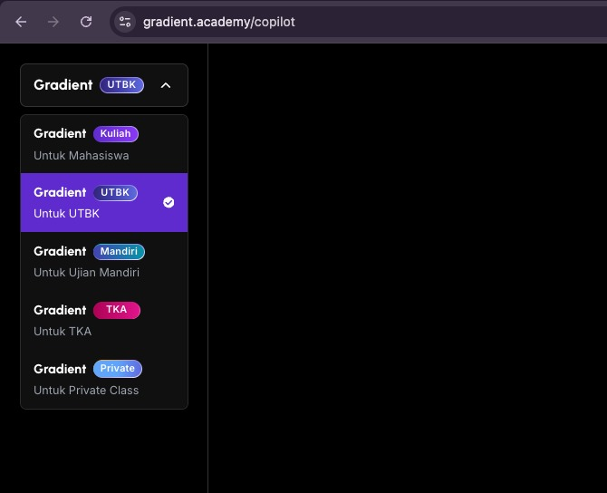
Type: fact
Isi : ok jadi secara tipe test di bagi 3 utbk (tryout),ujian mandiri(untuk masuk ptn), tka, next harus di coba masing-masing

### N-006 - berikut adalah temuan saya dari aplikasi gradient : https://gradient.academy/
Evidence: 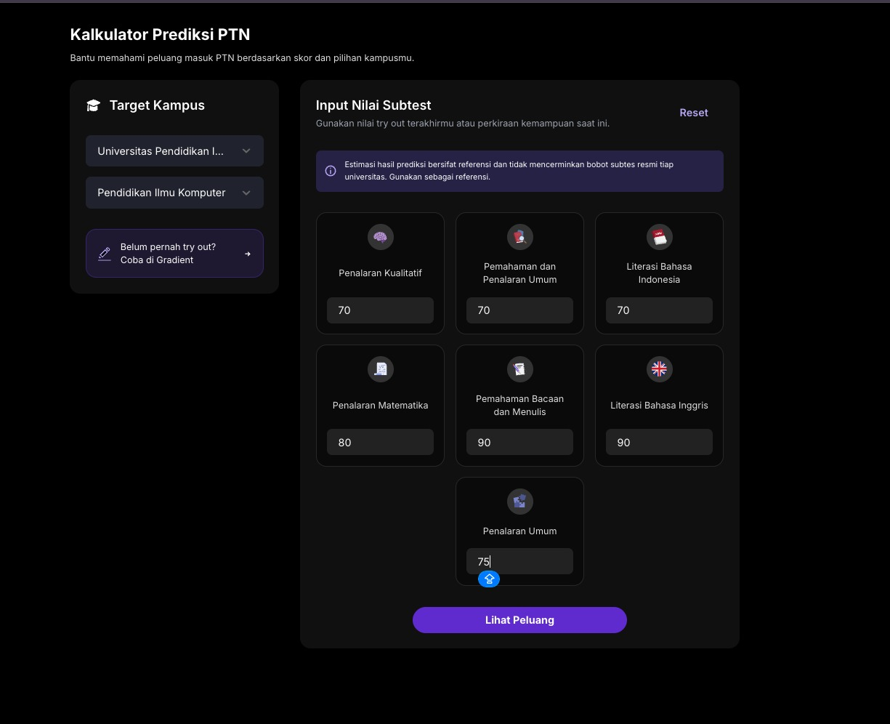 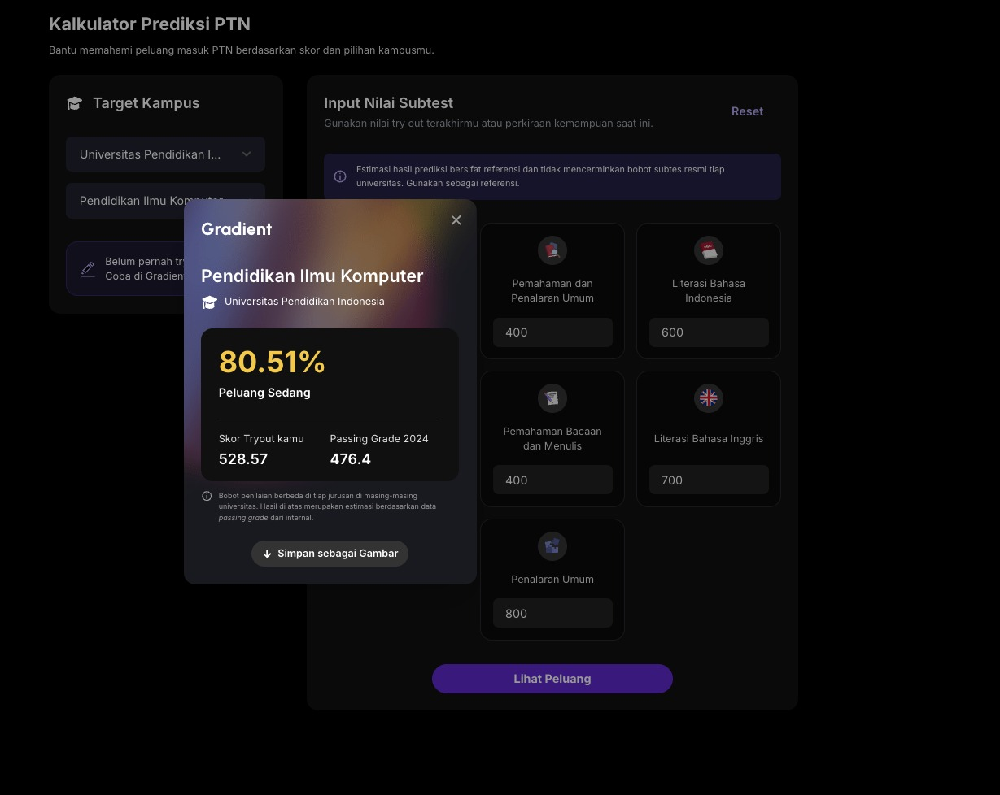
Type: fact
Isi : ini menarik perlu dibedah bagiamana cara kerja kalukator karena berhubugan dengan cara penilaian skor tryout yang saya coba jika masukan semua skor 1000 maka presentase jadi 100% asumsi saya ini berhubungan dengan sistem penilaian IRT

### N-006 - berikut adalah temuan saya dari aplikasi gradient
Evidence:  
Type: fact
Isi : 

### N-007 - pembagian menu soal
Evidence: 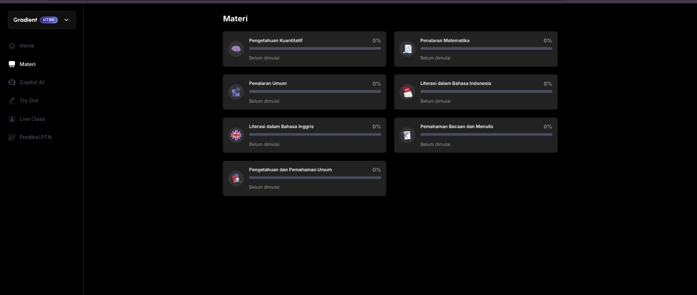  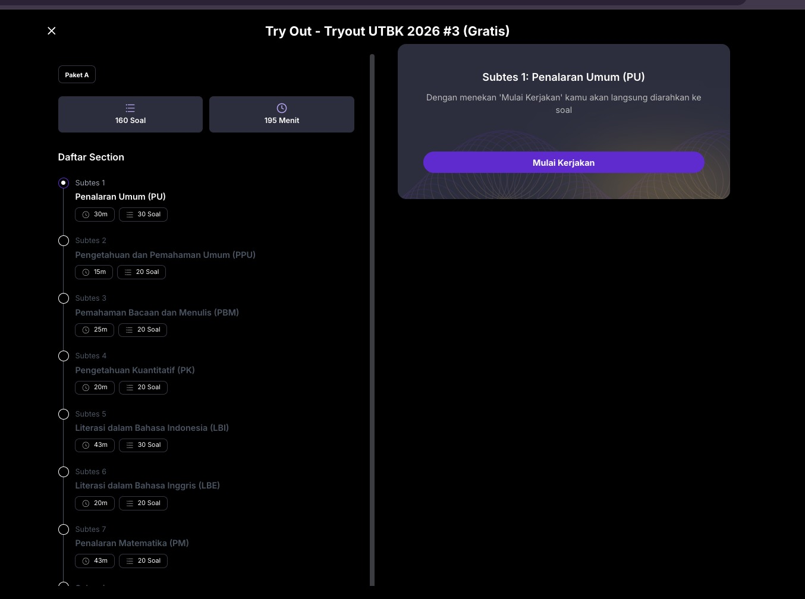
Type: fact
Isi : di gradient  materi dan soal utbk tidak deklompokan ke dalam mata pelajaran atau level kesulitan tapi lebih ke subtest seperti penalaiaran umum dan matematika dll, saya lihat di zenius juga, jadi bisa jadi secara sistem nasional pengelompokan soal tryout utbk mungkin seperti ini jadi perlu dipertimbangkan adanya meta soal untuk subtest

### N-008 - pilih ptn sebelum try out
Evidence: 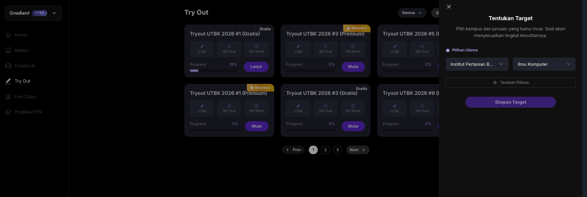
Type: fact
Isi : unikya sebelum memilih paket soal tryout dia harus pilih dulu ptn dan jurusan nya katanya ini untuk menentukan tingkat kesulitan soal yang akan di tryoutkan, tapi untuk setup ptn ini sifat nya global sekali

### N-009 - pembagian paket soal
Evidence: 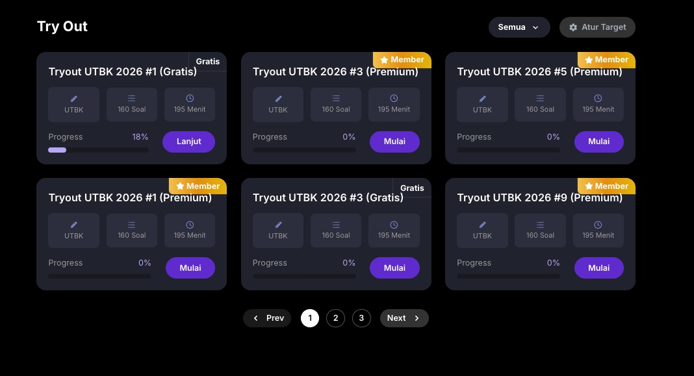
Type: fact 
isi kalo di gradient soal itu di bagi ke beberapa paket atribut paket (jumlah soal, waktu, progress, dan tipe) kalo tipe default nya semua utbk tapi kayanya ada tipe lain seperti TKA,SIMAK UI (untuk ujian UI) untuk progress kanya diamil dari last session, nah yang unik adalah sistem soal di pecah jadi paket 1 paket 130 soal, sedangkan di sistem yang akan kita buat soal nya akan diambil random 130 soal dari 1000 bank soal

### N-009 - isi satu sessi
Evidence: 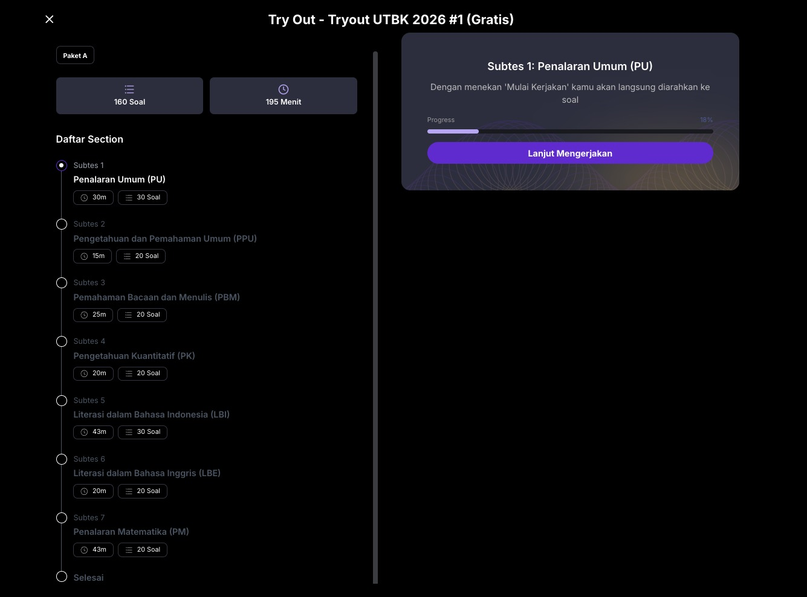
Type: fact 
isi : satu paket soal dibagi ke beberapa subset uniknya masing-masing subset ada durasi pengerjaan nya jadi durasi pengerjakan tidak di terapkan di level soal atau level tryout dan ketika sudah mengerjakan satu subset bisa mengerjakan ulang, tapi kalo pilih next subset tidak bisa balik lagi

### N-010 - tryout ujian mandiri
Evidence: 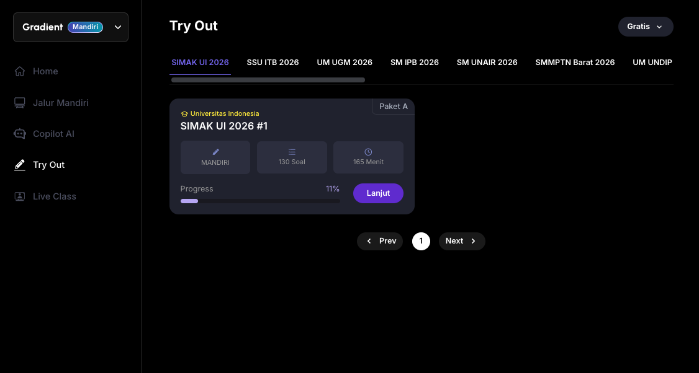 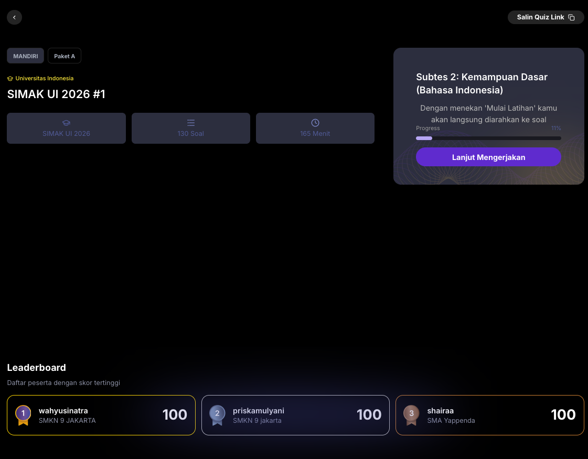 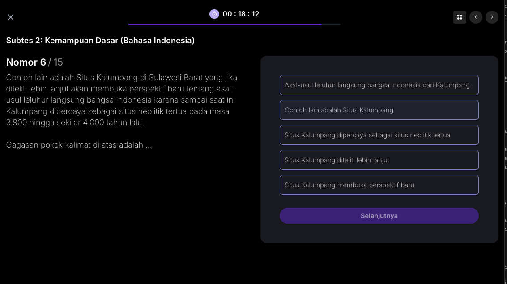 
Type: fact 
isi : ini adalah isi dari menu tryout ujian mandiri yang berbeda dari utbk yang unik disini soal ujian dikelompokan jadi berbgai Kampus, bisa jadi untuk setiap kampus dia punya atribut dan cara penilaian sendiri, yang unik dari ujian ini adalah ada leaderboard nya dan soal pembagian subtest nya beda seperti utbk (penalaran umum, matematika dst) jadi ada kemungkinan butuh data master subtest sebagai parent soal

### N-011 - hasil report tryout simak UI/asumsi yang utbk juga sama
Evidence: 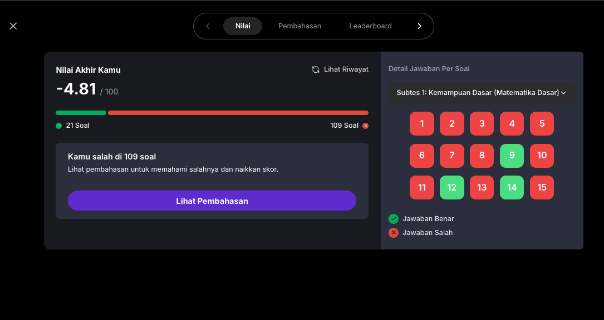 
type: fact
isi : ok untuk menu dibagi 3 : nilai, pembahasan, leaderboard, utnuk pembaghasan yang ditampilkan ada opsi yang dijawab, opsi benar yang seharusnya dijawab, dan rekomendasi materi (asumsi bisa jadi ada linking ke module materi nantinya, makanya bisa jadi penting dalam input soal ditentukan mapel dan submapel nya)

### N-011 - wahh ternyata soal bisa puny option multiple
Evidence: 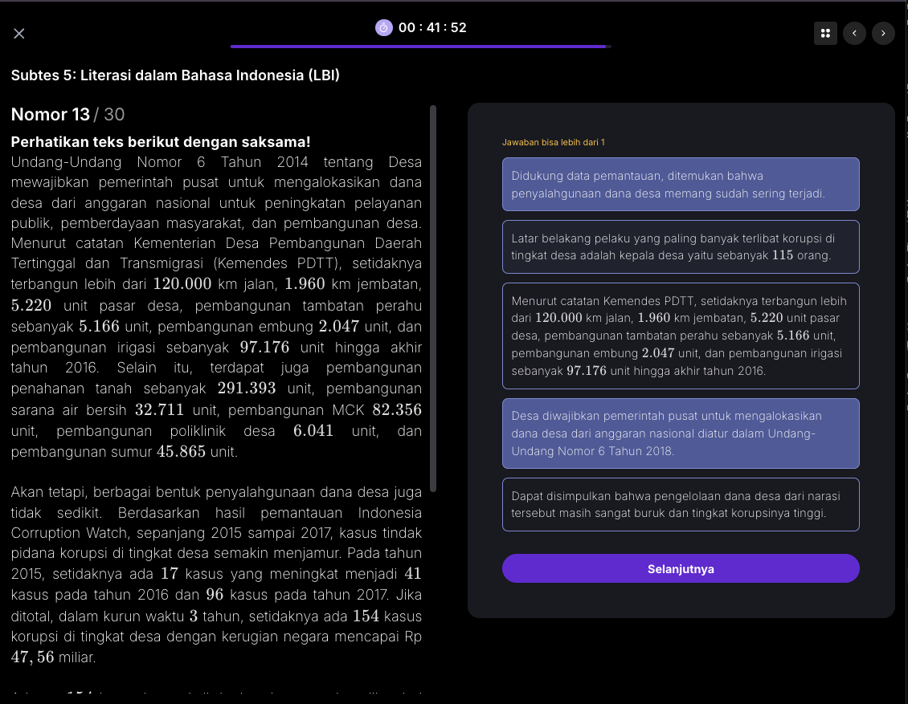 
type: fact
isi : dari sini saya berasumsi kita harus melihat simulasi rill dari platform utbk yang digunakan pemerintah wkwkwk

### N-012 - report tryout utbk sedikit beda degan report tka mandiri UI
Evidence: 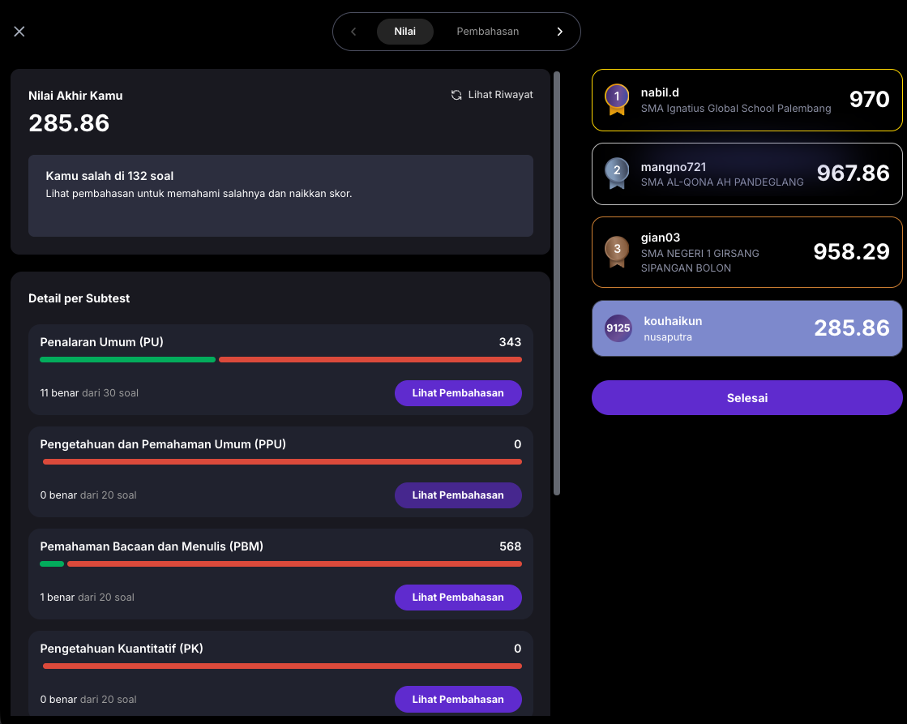 
type: fact
isi : jadi hasil report analisa soal nya dibagi ke per subset tidak 1 tryout kalo mode pembahasan nya sih sama

### N-013 - halaman daftar tryout di platform aimasukptn
Evidence: 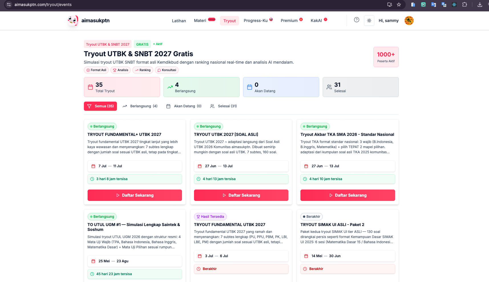
Type: fact
Isi : di aimasukptn daftar tryout ditampilkan dalam bentuk card (mirip pola card blog), tiap card punya status (Berlangsung/Akan Datang/Berakhir/Hasil Tersedia), judul, deskripsi singkat, rentang tanggal mulai-selesai, sisa waktu, dan CTA daftar. Ini senada dengan N-009 (gradient) yang juga membagi soal ke beberapa paket, jadi kemungkinan pola "tryout = kumpulan paket/card" ini umum dipakai lintas platform dan perlu dipertimbangkan di struktur data paket tryout

### N-014 - isi salah satu paket tryout di aimasukptn dibagi ke 7 subtes
Evidence: 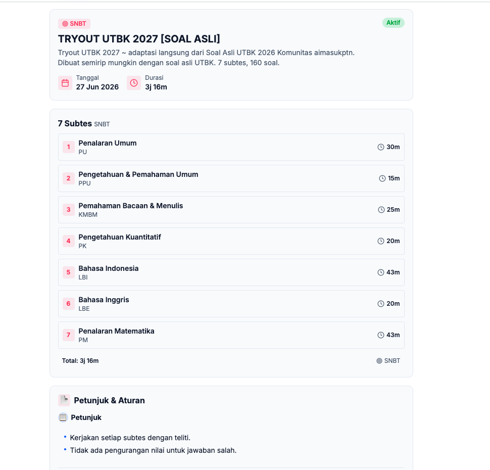
Type: fact
Isi : paket "TRYOUT UTBK 2027 [SOAL ASLI]" (160 soal, total durasi 3j16m) dibagi jadi 7 subtes: Penalaran Umum (PU, 30m), Pengetahuan & Pemahaman Umum (PPU, 15m), Pemahaman Bacaan & Menulis (KMBM, 25m), Pengetahuan Kuantitatif (PK, 20m), Bahasa Indonesia (LBI, 43m), Bahasa Inggris (LBE, 20m), Penalaran Matematika (PM, 43m). Ini mengkonfirmasi N-009/N-010 (gradient) bahwa durasi menempel di level subtes bukan di level soal/tryout. Sumber penentuan 7 subtes ini (apakah standar resmi SNBT atau racikan platform) belum diketahui, perlu diverifikasi. Halaman ini juga menampilkan aturan "Tidak ada pengurangan nilai untuk jawaban salah" (no penalty), relevan untuk Q-002 soal perbedaan skema penilaian antar jenis ujian

### N-015 - relasi subtest ke topik di menu Bank Soal aimasukptn
Evidence: 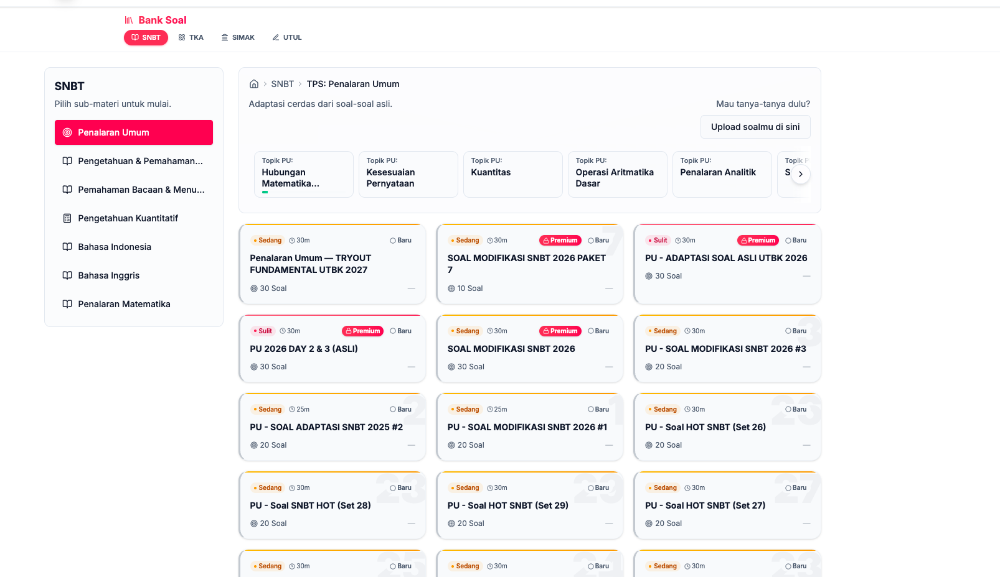
Type: fact
Isi : di menu Bank Soal > SNBT, sidebar menampilkan 7 subtest yang sama dengan N-014 (Penalaran Umum, Pengetahuan & Pemahaman Umum, Pemahaman Bacaan & Menulis, Pengetahuan Kuantitatif, Bahasa Indonesia, Bahasa Inggris, Penalaran Matematika). Saat subtest "Penalaran Umum (PU)" dipilih, breadcrumb menunjukkan "SNBT > TPS: Penalaran Umum" dan muncul filter chip "Topik PU": Hubungan Matematika, Kesesuaian Pernyataan, Kuantitas, Operasi Aritmatika Dasar, Penalaran Analitik, dst (list topik terpotong, masih ada lanjutan). Ini mengkonfirmasi relasi one2many antara subtest dan topik (satu subtest punya banyak topik turunan). Halaman ini polanya juga daftar paket soal berbentuk card tidak terstruktur (mirip N-013), tiap card punya atribut level kesulitan (Sedang/Sulit), durasi, jumlah soal, status Baru, dan tag Premium opsional

### N-015a - subtes dan topik
type : assumsion
isi : kalo dilihat di di berbagai platform gradient,zenius,aimasukptn untuk isi dari paket soal tryout utbk itu isi nya konsisten 7 subtes (Penalaran Umum (PU), Pengetahuan & Pemahaman Umum (PPU), Pemahaman Bacaan & Menulis (PBM), Pengetahuan Kuantitatif (PK), Literasi dalam Bahasa Indonesia (LBI), Literasi dalam Bahasa Inggris (LBE), Penalaran Matematika (PM)) nah masalah nya untuk data topik dari setiap subtes beluma ada pakem nya kemungkinan bisa cari di aimptn dan zenius untuk lihat polanya

### N-016 - bank soal TKA di aimasukptn, filter mapel dan topik
Evidence: 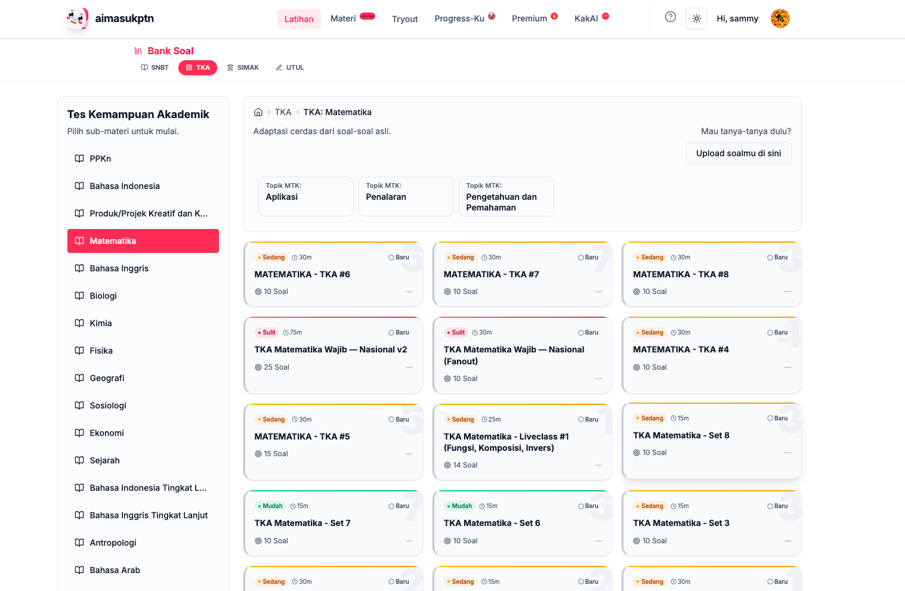
Type: fact
Isi : di menu Bank Soal > TKA, sidebar filter berisi nama-nama mata pelajaran (PPKn, Bahasa Indonesia, Produk/Projek Kreatif dan K..., Matematika, Bahasa Inggris, Biologi, Kimia, Fisika, Geografi, Sosiologi, Ekonomi, Sejarah, Bahasa Indonesia Tingkat Lanjut, Bahasa Inggris Tingkat Lanjut, Antropologi, Bahasa Arab, dst), berbeda dengan SNBT yang filternya berupa 7 subtest (N-014/N-015). Saat mapel "Matematika" dipilih, breadcrumb "TKA > TKA: Matematika" dan topik yang muncul cuma 3: "Topik MTK: Aplikasi", "Topik MTK: Penalaran", "Topik MTK: Pengetahuan dan Pemahaman"

Type: assumption
Isi : saya asumsikan mapel di TKA berada di level yang sama dengan subtest di SNBT (mis. Penalaran Umum). Saya awalnya menduga topik di TKA akan berupa nama-nama bab materi (seperti logaritma, statistik), tapi ternyata topik untuk Matematika cuma ada 3 (Aplikasi, Penalaran, Pengetahuan dan Pemahaman) - lebih sedikit dari yang saya bayangkan, perlu diverifikasi lebih lanjut apakah topik ini representasi bab atau bukan

### N-017 - dua mode buka paket soal di bank soal SNBT (bukan tryout)
Evidence: 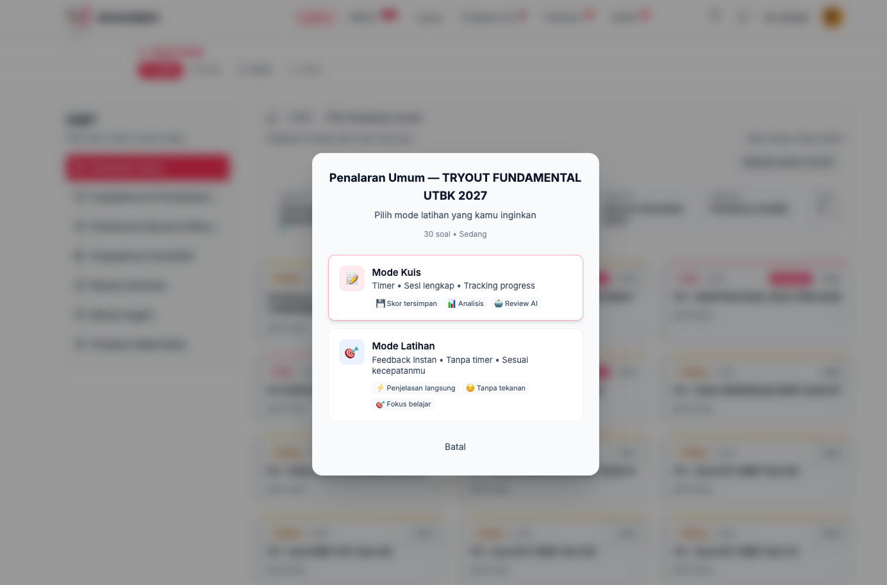
Type: fact
Isi : saat membuka salah satu paket soal SNBT di menu Latihan/Bank Soal (bukan menu Tryout), muncul modal pilihan 2 mode: "Mode Kuis" (ada timer, sesi lengkap, tracking progress, skor tersimpan, analisis, review AI) dan "Mode Latihan" (tanpa timer, feedback instan/penjelasan langsung per soal, sesuai kecepatan sendiri, tanpa tekanan, fokus belajar - langsung dikasih tau salah/benar beserta pembahasan). Ini relevan dengan atribut "mode_soal" (try_out/latihan) yang disebut di Q-001, hanya saja disini penamaannya "Kuis" vs "Latihan"

### N-018 - halaman mengerjakan soal mode latihan
Evidence: 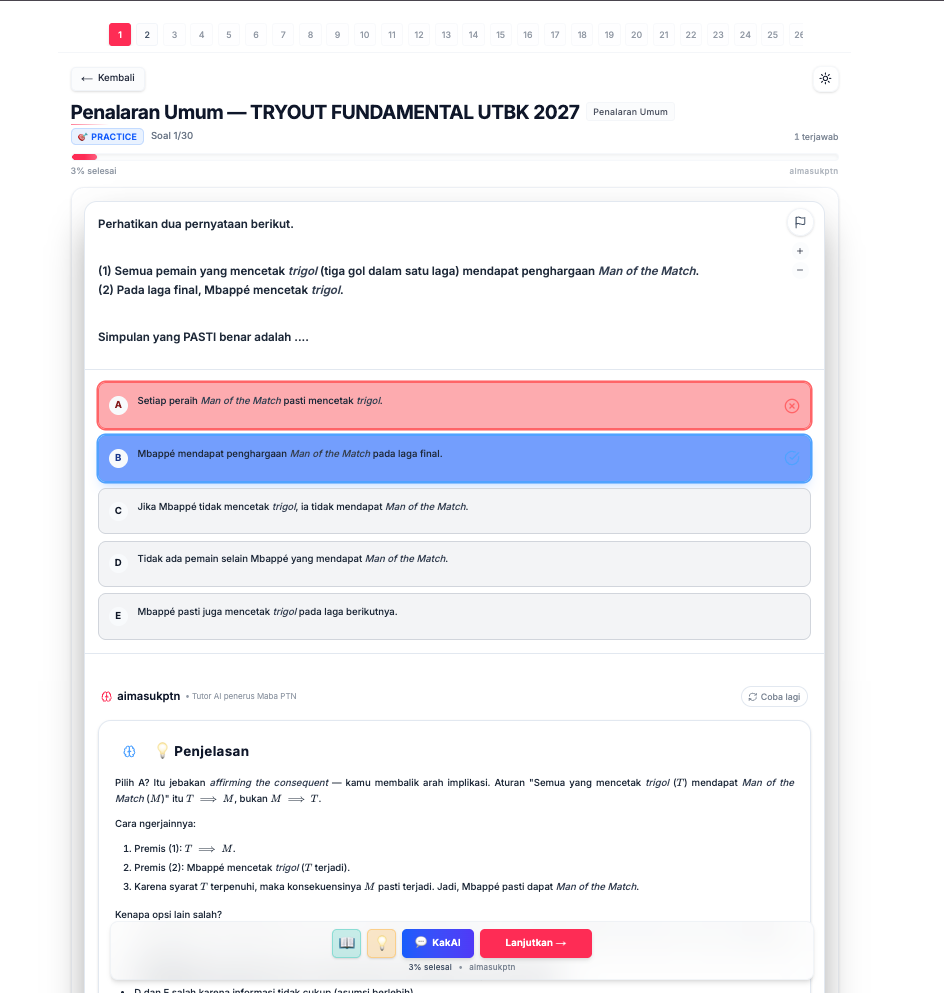
Type: fact
Isi : elemen UI halaman mengerjakan soal mode latihan (paket "Penalaran Umum — TRYOUT FUNDAMENTAL UTBK 2027", soal 1/30): pagination nomor soal di atas, teks pertanyaan, 5 opsi jawaban (A-E), opsi yang dipilih ditandai (highlight biru + centang), opsi jawaban yang benar juga ditandai beda warna dari yang salah (merah + silang untuk opsi yang salah dipilih), dan di bawahnya ada section "Penjelasan" dari "aimasukptn - Tutor AI penerus Maba PTN" berisi pembahasan langkah demi langkah plus tombol "Coba lagi" (regenerate), "KakAI" (chat AI lanjutan), dan "Lanjutkan"

Type: assumption
Isi : karena pembahasan/penjelasan ditampilkan seperti hasil AI (branding "Tutor AI", ada tombol "Coba lagi" untuk generate ulang), saya menduga sebaiknya penjelasan soal di-generate sekali lalu disimpan dan dipakai ulang (cached/reusable) per soal, bukan digenerate ulang tiap kali siswa berbeda membuka soal yang sama - supaya lebih hemat biaya/token AI. Ini masih dugaan saya soal bagaimana sebaiknya arsitektur kita dibuat, bukan fakta tentang bagaimana aimasukptn benar-benar mengimplementasikannya di backend mereka, perlu didiskusikan lebih lanjut untuk desain sistem sendiri

### N-019 - summary hasil tes mode latihan
Evidence: 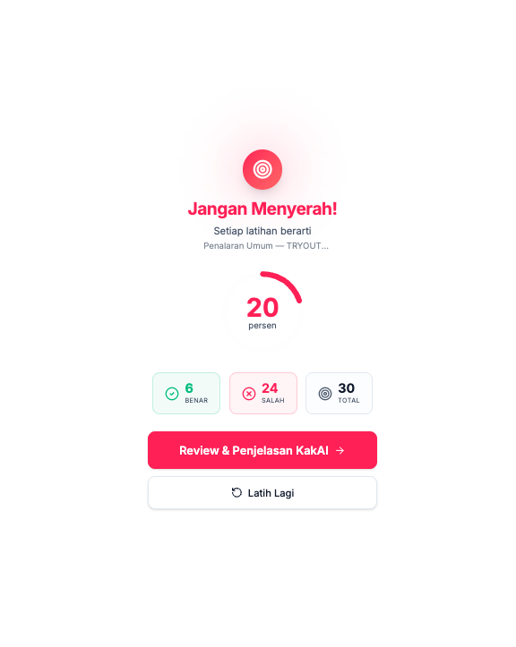
Type: fact
Isi : halaman summary hasil sesudah selesai mengerjakan mode latihan (paket "Penalaran Umum — TRYOUT...") hanya menampilkan: persentase skor (20 persen), jumlah Benar (6), jumlah Salah (24), Total soal (30), pesan motivasi ("Jangan Menyerah! Setiap latihan berarti"), tombol "Review & Penjelasan KakAI" dan "Latih Lagi". Tidak ada breakdown per subtest/topik seperti report tryout (bandingkan N-011/N-012), lebih sederhana karena mode latihan sifatnya per-paket bukan per-tryout multi-subtest

### N-020 - pengerjaan soal mode kuis (bank soal SNBT, paket Penalaran Umum)
Evidence: 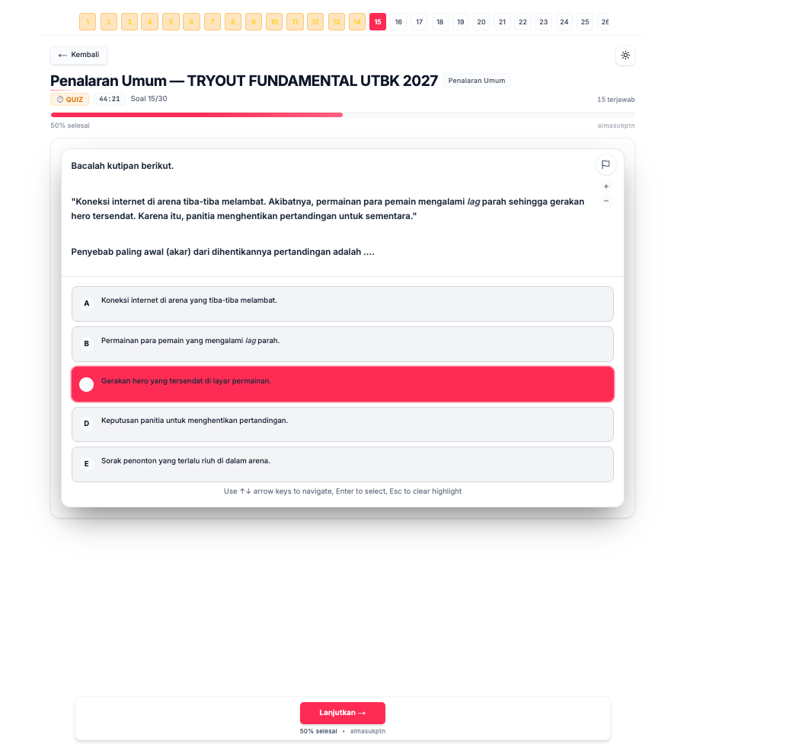
Type: fact
Isi : tampilan mode Kuis untuk paket "Penalaran Umum — TRYOUT FUNDAMENTAL UTBK 2027" (30 soal) mirip mode Latihan (pagination nomor soal, pertanyaan, 5 opsi A-E) tapi tanpa langsung menampilkan jawaban benar/salah saat memilih opsi - opsi yang dipilih cuma ditandai highlight merah polos. Ada timer hitung mundur (44:21) dan progress "50% selesai - 15 terjawab" di header, lalu tombol "Lanjutkan" di bawah. Timer disini berjalan untuk 1 paket kuis secara keseluruhan (bukan per subtest terpisah) - perlu dicatat paket ini sendiri sudah berlabel 1 subtest ("Penalaran Umum") karena diambil dari Bank Soal SNBT, jadi ini beda konteks dari sesi Tryout multi-subtest yang durasinya nempel per-subtest di N-009/N-014

### N-021 - summary report hasil mode kuis (bank soal SNBT)
Evidence: 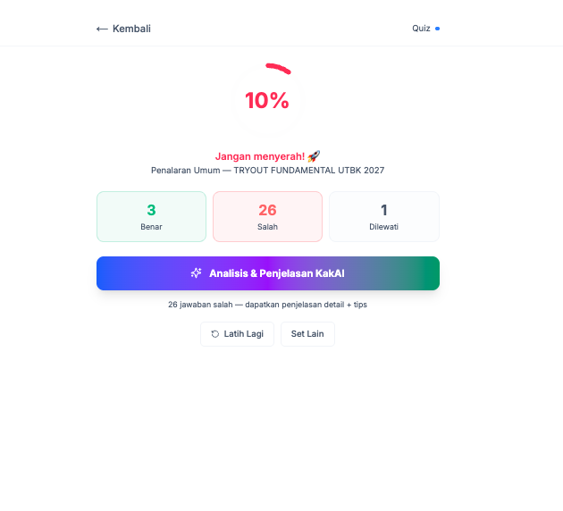
Type: fact
Isi : halaman summary hasil mode Kuis (paket "Penalaran Umum — TRYOUT FUNDAMENTAL UTBK 2027") menampilkan: persentase (10%), jumlah Benar (3), jumlah Salah (26), jumlah Dilewati (1), pesan motivasi ("Jangan menyerah!"), tombol "Analisis & Penjelasan KakAI", serta "Latih Lagi" dan "Set Lain". Dibanding summary mode Latihan (N-019), disini ada field tambahan "Dilewati" (skipped) - masuk akal karena di mode Kuis siswa bisa lewat soal tanpa jawab dulu (beda dari mode Latihan yang langsung kasih feedback per soal jadi kemungkinan tidak ada skip)

### N-022 - halaman review soal hasil mode kuis
Evidence: 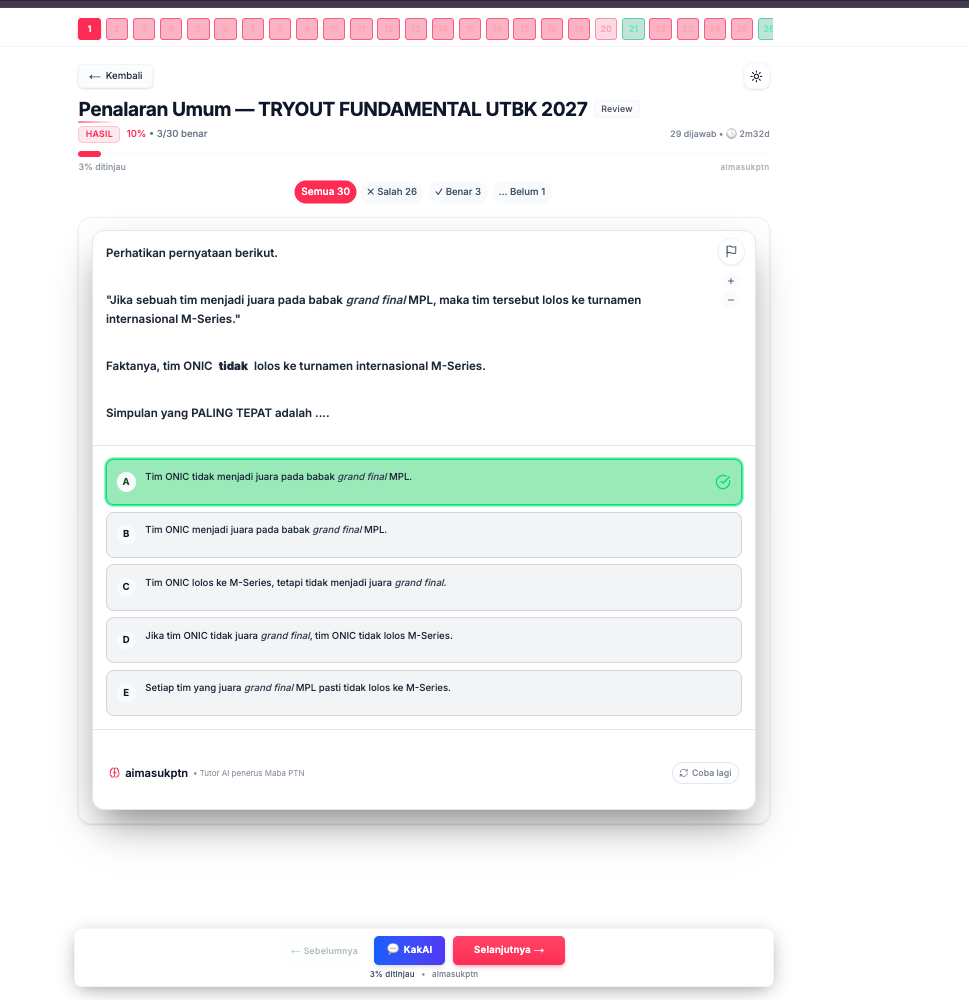
Type: fact
Isi : halaman "Review" untuk hasil mode Kuis (paket "Penalaran Umum — TRYOUT FUNDAMENTAL UTBK 2027", 10%, 3/30 benar) elemen UI-nya: navigasi pagination nomor soal dengan warna status per soal (merah=salah, hijau=benar, abu=belum dijawab), tab filter "Semua 30 / Salah 26 / Benar 3 / Belum 1", lalu per soal ditampilkan opsi yang seharusnya dipilih ditandai hijau+centang (tidak menampilkan highlight merah untuk opsi yang salah dipilih siswa pada contoh ini), dan section pembahasan dari "aimasukptn - Tutor AI" dengan tombol "Coba lagi", "KakAI", dan navigasi "Sebelumnya/Selanjutnya". Struktur elemen ini mirip dengan halaman mengerjakan soal mode Latihan (N-018) - opsi jawaban + pembahasan AI

Type: assumption
Isi : karena struktur UI halaman review mode Kuis ini mirip dengan halaman mengerjakan soal mode Latihan (N-018), saya menduga komponen UI-nya bisa direuse antara kedua mode tersebut (cuma beda mode tampil realtime feedback vs review setelah selesai), perlu dipertimbangkan saat desain komponen soal di app kita

### N-023 - referensi video zenius soal skema IRT 3PL
Evidence: https://www.youtube.com/watch?v=mEdSDxuXYNY
Type: assumption
Isi : dari video zenius ada indikasi skema IRT yang dipakai kemungkinan 3PL (Three-Parameter Logistic), dengan 3 parameter yang dibutuhkan: difficulty, discrimination, guessing. Ini melengkapi N-001 yang masih belum jelas pakai IRT L1/L2/L3 - kemungkinan menjawab bahwa yang dipakai adalah L3/3PL, tapi tetap perlu diverifikasi ke sumber resmi karena masih dari video pihak ketiga (bukan dokumentasi resmi Kemdikbud)

### N-024 - rentang skor UTBK 200-800 versi zenius vs klaim 1000 di gradient
Evidence: https://www.youtube.com/watch?v=mEdSDxuXYNY
Type: assumption
Isi : video zenius menyebut rentang nilai UTBK adalah 200-800, ini bertentangan dengan temuan N-002 (di gradient katanya nilai maksimal 1000). Belum jelas mana yang benar atau apakah beda skema/beda tahun, perlu diverifikasi ke sumber resmi

### N-025 - rumus konversi skor theta ke skor akhir versi video zenius
Evidence: https://www.youtube.com/watch?v=mEdSDxuXYNY
Type: assumption
Isi : video zenius menyebut cara menghitung skor akhir dari theta (hasil estimasi IRT) pakai rumus: skor = 500 + (100 * theta). Asal-usul angka 500 dan 100 ini belum jelas, perlu diverifikasi ke sumber resmi. Ini juga terkait N-024 soal rentang skor yang masih belum konsisten antar sumber (200-800 vs 1000)